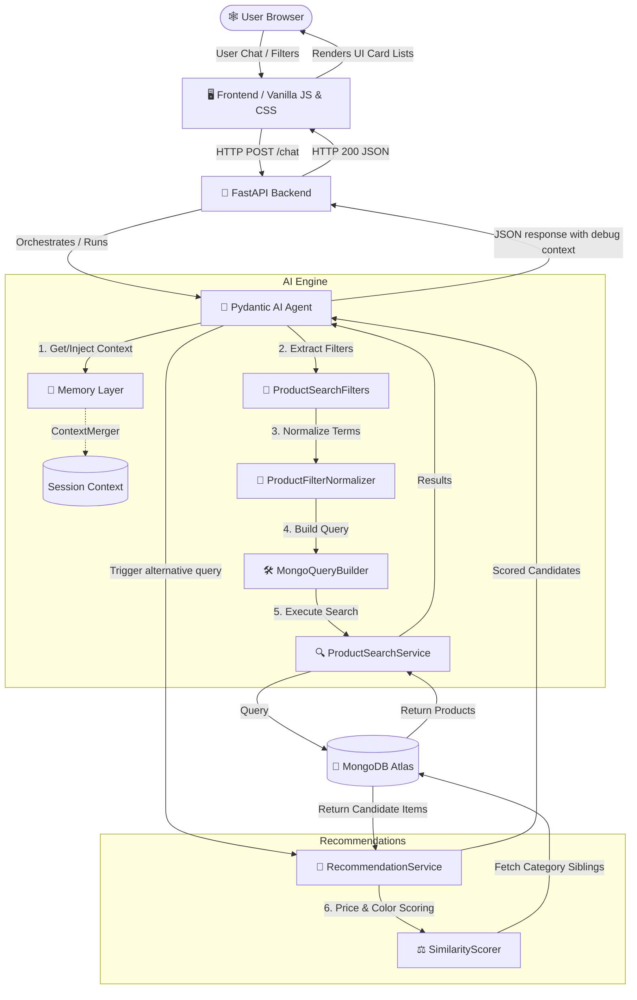

# 🕸️ Spidey Store: AI-Powered Conversational Commerce

[](#)
[](#)
[](#)
[](#)
[](#)
[](#)
[](#)

> **Spidey Store** is a premium, Apple-meets-Spider-Man styled digital storefront designed to showcase an intelligent, multi-turn AI Shopping Assistant. Move beyond simple keyword matching and rigid filtering—experience natural, context-aware conversational shopping.

---

## 🌌 Overview

### The Motivation
Standard e-commerce search engines are rigid. They rely heavily on exact keyword matches, hardcoded category selectors, and sidebar filter checkboxes. If a customer searches for *"something warm and red for winter"*, standard database queries often return zero results because they lack semantic awareness. 

### Why Conversational Commerce Matters
Conversational Commerce bridges this gap. By mapping free-form language to structured database queries, preserving session-based memory, and recommending products dynamically, **Spidey Store** lets users converse with the database like they would talk to a real-life retail salesperson. 

The AI Shopping Assistant uses **Text-to-NoSQL** mapping to parse complex natural language intent into granular MongoDB search filters, making shopping organic, fast, and responsive.

---

## ✨ Key Features

*   **🤖 AI Shopping Assistant (Text2NoSQL):** Powered by **Pydantic AI** and Groq (`Qwen 2.5 32B`), this assistant extracts customer filters from unstructured chats to build database queries under the hood.
*   **🧠 Multi-Turn Conversation Memory:** Remembers shopping context. If you ask for *"men's jackets"* and then type *"under ₹3000"*, the system merges these queries to retrieve men's jackets under ₹3000.
*   **🔍 Structured Retrieval Layer:** Features a modular parser pipeline ([ProductSearchFilters](file:///d:/ENGINEER/ECOMCHATBOT/RESOURCES/SOURCE_CODE/backend/models/search_filters.py) → [ProductFilterNormalizer](file:///d:/ENGINEER/ECOMCHATBOT/RESOURCES/SOURCE_CODE/backend/services/normalizer.py) → [MongoQueryBuilder](file:///d:/ENGINEER/ECOMCHATBOT/RESOURCES/SOURCE_CODE/backend/services/query_builder.py) → [ProductSearchService](file:///d:/ENGINEER/ECOMCHATBOT/RESOURCES/SOURCE_CODE/backend/services/product_search.py)) to normalize colloquialisms (e.g. *"tees"* → *"T-Shirt"*, *"reddish"* → *"Red"*).
*   **🎯 Content-Based Recommendation Engine:** Employs a custom [SimilarityScorer](file:///d:/ENGINEER/ECOMCHATBOT/RESOURCES/SOURCE_CODE/backend/services/recommendation/scorer.py) that evaluates price bounds, colors, categories, and review ratings to suggest similar products, budget alternatives, or premium upgrades.
*   **🕸️ Spider-Man Inspired Interface:** A responsive frontend inspired by **macOS glassmorphism** and the **Spider-Man color palette** (sleek dark mode, neon web accents, Apple-style terminal chat container, and slide-in shopping cart panel).
*   **⚡ Seeder Endpoints:** Instantly populate the database with over 500+ realistic clothing products for testing with a single click.
*   **🔭 Deep Observability:** Built-in integration with **Pydantic Logfire** for tracing latency, database operations, and LLM tool call decisions in real-time.

---

## 🏗️ Architecture Flow

The system decouples the AI orchestration agent from the core retrieval and recommendation logic, allowing you to swap database engines or LLMs without altering frontend schemas.



---

## 🛠️ Technology Stack

| Layer | Technology | Purpose |
| :--- | :--- | :--- |
| **Frontend** | Pure Vanilla JS (ES Modules) & Native CSS | Modern Apple-inspired dark mode layout with custom Spider-Man accents. Light, responsive, and dependency-free. |
| **Backend** | [FastAPI](file:///d:/ENGINEER/ECOMCHATBOT/RESOURCES/SOURCE_CODE/main.py) (Python 3.10+) | High-performance asynchronous REST API server. |
| **AI Framework** | Pydantic AI | Schema-enforced tool execution and structured agent responses. |
| **LLM Model** | Qwen 2.5 32B (via Groq Cloud) | Fast, state-of-the-art open-source Large Language Model. |
| **Database** | MongoDB Atlas (NoSQL) | Flexible document store for inventory, shopping carts, and order details. |
| **Validation** | Pydantic v2 | Type safety and strict data formatting validation on incoming data payloads. |
| **Observability** | Pydantic Logfire | Production-level telemetry, execution trace monitoring, and prompt engineering logging. |

---

## 📂 Project Structure

```text
.
├── backend/                    # Python Backend Source
│   ├── models/                 # Pydantic data schemas
│   │   ├── [conversation_context.py](file:///d:/ENGINEER/ECOMCHATBOT/RESOURCES/SOURCE_CODE/backend/models/conversation_context.py)
│   │   ├── [recommendation.py](file:///d:/ENGINEER/ECOMCHATBOT/RESOURCES/SOURCE_CODE/backend/models/recommendation.py)
│   │   └── [search_filters.py](file:///d:/ENGINEER/ECOMCHATBOT/RESOURCES/SOURCE_CODE/backend/models/search_filters.py)
│   ├── routes/                 # FastAPI controllers
│   │   ├── [cart.py](file:///d:/ENGINEER/ECOMCHATBOT/RESOURCES/SOURCE_CODE/backend/routes/cart.py)             # Cart add / retrieve operations
│   │   ├── [chatbot.py](file:///d:/ENGINEER/ECOMCHATBOT/RESOURCES/SOURCE_CODE/backend/routes/chatbot.py)          # AI agent setup & chat endpoints
│   │   ├── [orders.py](file:///d:/ENGINEER/ECOMCHATBOT/RESOURCES/SOURCE_CODE/backend/routes/orders.py)           # Order submission endpoint
│   │   └── [products.py](file:///d:/ENGINEER/ECOMCHATBOT/RESOURCES/SOURCE_CODE/backend/routes/products.py)         # Inventory CRUD & seeder endpoints
│   ├── services/               # Core business logic
│   │   ├── memory/             # Multi-turn context & state merger
│   │   │   ├── [context_merger.py](file:///d:/ENGINEER/ECOMCHATBOT/RESOURCES/SOURCE_CODE/backend/services/memory/context_merger.py)
│   │   │   └── [memory_manager.py](file:///d:/ENGINEER/ECOMCHATBOT/RESOURCES/SOURCE_CODE/backend/services/memory/memory_manager.py)
│   │   ├── recommendation/     # Similarity scoring engine
│   │   │   ├── [recommendation_service.py](file:///d:/ENGINEER/ECOMCHATBOT/RESOURCES/SOURCE_CODE/backend/services/recommendation/recommendation_service.py)
│   │   │   └── [scorer.py](file:///d:/ENGINEER/ECOMCHATBOT/RESOURCES/SOURCE_CODE/backend/services/recommendation/scorer.py)
│   │   ├── [normalizer.py](file:///d:/ENGINEER/ECOMCHATBOT/RESOURCES/SOURCE_CODE/backend/services/normalizer.py)       # Entity & query normalizer
│   │   ├── [product_search.py](file:///d:/ENGINEER/ECOMCHATBOT/RESOURCES/SOURCE_CODE/backend/services/product_search.py)   # Database query executor
│   │   └── [query_builder.py](file:///d:/ENGINEER/ECOMCHATBOT/RESOURCES/SOURCE_CODE/backend/services/query_builder.py)    # MongoDB syntax constructor
│   └── [database.py](file:///d:/ENGINEER/ECOMCHATBOT/RESOURCES/SOURCE_CODE/backend/database.py)             # MongoDB connection configuration
├── docs/                       # Technical design documents
│   ├── [00-terminologies.md](file:///d:/ENGINEER/ECOMCHATBOT/RESOURCES/SOURCE_CODE/docs/00-terminologies.md)       # Analogies for core components
│   ├── [structured_retrieval.md](file:///d:/ENGINEER/ECOMCHATBOT/RESOURCES/SOURCE_CODE/docs/structured_retrieval.md)   # Deep dive on parsing pipelines
│   └── [multi_turn_memory.md](file:///d:/ENGINEER/ECOMCHATBOT/RESOURCES/SOURCE_CODE/docs/multi_turn_memory.md)      # Context lifecycles
├── Frontend/                   # Browser UI assets
│   ├── src/
│   │   ├── components/         # Modular layout units
│   │   ├── images/             # UI icons and graphic assets
│   │   ├── services/           # Chat & product API clients
│   │   ├── [main.js](file:///d:/ENGINEER/ECOMCHATBOT/RESOURCES/SOURCE_CODE/Frontend/src/main.js)             # Main SPA entrypoint
│   │   ├── [router.js](file:///d:/ENGINEER/ECOMCHATBOT/RESOURCES/SOURCE_CODE/Frontend/src/router.js)           # Frontend route controller
│   │   └── [style.css](file:///d:/ENGINEER/ECOMCHATBOT/RESOURCES/SOURCE_CODE/Frontend/src/style.css)           # Spider-Man & macOS stylesheet
│   └── [index.html](file:///d:/ENGINEER/ECOMCHATBOT/RESOURCES/SOURCE_CODE/Frontend/index.html)              # Main HTML entrypoint
├── [Dockerfile](file:///d:/ENGINEER/ECOMCHATBOT/RESOURCES/SOURCE_CODE/Dockerfile)                  # Application deployment config
├── [main.py](file:///d:/ENGINEER/ECOMCHATBOT/RESOURCES/SOURCE_CODE/main.py)                     # Entry point (fastapi uvicorn server)
├── [requirements.txt](file:///d:/ENGINEER/ECOMCHATBOT/RESOURCES/SOURCE_CODE/requirements.txt)            # System dependencies
└── [README.md](file:///d:/ENGINEER/ECOMCHATBOT/RESOURCES/SOURCE_CODE/README.md)                   # Project documentation
```

---

## ⚙️ Installation & Setup

### Prerequisites
*   Python 3.10 or higher
*   MongoDB Atlas Account (or local MongoDB Community Edition instance)
*   Groq API Key
*   Pydantic Logfire Token (Optional, for observability tracing)

### 1. Clone the Repository
```bash
git clone https://github.com/your-username/spidey-store.git
cd spidey-store
```

### 2. Configure Environment Variables
Create a `.env` file in the root directory:
```env
MONGO_URI=mongodb+srv://<username>:<password>@cluster.xxxx.mongodb.net/spideystore?retryWrites=true&w=majority
GROQ_API_KEY=gsk_xxxxxxxxxxxxxxxxxxxxxxxxxxxxxxxxxxxxxxxx
LOGFIRE_TOKEN=lf_xxxxxxxxxxxxxxxxxxxxxxxxxxxxxxxxxx
```

### 3. Setup Virtual Environment & Install Dependencies
```bash
# Create environment
python -m venv venv

# Activate on Windows
venv\Scripts\activate

# Activate on macOS/Linux
# source venv/bin/activate

# Install requirements
pip install -r requirements.txt
```

### 4. Run the Application
Start the FastAPI server:
```bash
python main.py
```
This runs the backend on `http://localhost:8000` and automatically mounts the frontend on `http://localhost:8000/`.

---

## 🐳 Running with Docker

You can easily package and run the store inside a container:

```bash
# Build the Docker image
docker build -t spidey-store .

# Run the container (make sure your .env exists in the directory)
docker run -p 8000:8000 --env-file .env spidey-store
```
Visit `http://localhost:8000/` in your browser.

---

## 🗺️ API Documentation

Once the app is running, FastAPI automatically serves interactive Swagger docs at `http://localhost:8000/docs`.

### Primary Endpoints
*   `POST /chat` - Interact with the AI Shopping Assistant ([chatbot.py](file:///d:/ENGINEER/ECOMCHATBOT/RESOURCES/SOURCE_CODE/backend/routes/chatbot.py))
*   `POST /products/bulk-generate-500` - Seed the database with test inventory items ([products.py](file:///d:/ENGINEER/ECOMCHATBOT/RESOURCES/SOURCE_CODE/backend/routes/products.py))
*   `GET /products/{id}/recommendations` - Run content similarity matching on a product ([products.py](file:///d:/ENGINEER/ECOMCHATBOT/RESOURCES/SOURCE_CODE/backend/routes/products.py))
*   `POST /cart/add` - Add products to the cart ([cart.py](file:///d:/ENGINEER/ECOMCHATBOT/RESOURCES/SOURCE_CODE/backend/routes/cart.py))
*   `GET /cart/{email}` - View user shopping cart items ([cart.py](file:///d:/ENGINEER/ECOMCHATBOT/RESOURCES/SOURCE_CODE/backend/routes/cart.py))

---

## 🎬 Demo

### Chat Assistant Interface
*(Placeholder for Demo GIF/Video)*


### Recommendation & macOS Dock Layout
*(Placeholder for Layout Screenshots)*


---

## 🚀 Future Roadmap

*   **🔍 Hybrid Search Integration:** Combine MongoDB lexical queries with Vector Search (via MongoDB Atlas Vector Search or Pinecone) to allow high-accuracy semantic search.
*   **🖼️ Visual Search:** Allow users to upload or drag images of clothing items into the chat bubble, passing embeddings through an image encoder to match catalog items.
*   **🗣️ Voice-Activated Shopping:** Integrate Web Speech API directly in the frontend for voice-to-text input to the assistant.
*   **🔒 Customer Authentication:** Incorporate Auth0 or JWT logins to save users' persistent fit types, sizing preferences, and previous purchases.
*   **💾 Distributed Redis Cache:** Transition the in-memory Python dictionary session storage to Redis to support horizontally scaled microservices.

---

## 📝 License

Distributed under the **MIT License**. Feel free to use, modify, and distribute this template as you see fit.

---

## 🧑‍💻 Author

**Ajitesh Channa**
*   **LinkedIn:** [linkedin.com/in/ajiteshchanna](https://linkedin.com/in/ajiteshchanna) *(Placeholder)*
*   **GitHub:** [github.com/ajiteshchanna](https://github.com/ajiteshchanna) *(Placeholder)*
